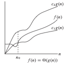

# Análisis de Complejidad Temporal

En análisis de algoritmos, la **complejidad temporal** es una medida del tiempo que tarda un algoritmo en ejecutarse en función del tamaño de la entrada. Nos permite evaluar el rendimiento y la eficiencia de un algoritmo sin depender del hardware o las condiciones específicas de ejecución.

### ¿Por qué es importante?

El análisis de la complejidad temporal es fundamental para:

* Comparar diferentes algoritmos que resuelven el mismo problema.
* Identificar cuellos de botella y optimizar el rendimiento.
* Predecir el comportamiento del algoritmo a medida que aumenta el tamaño de los datos.

### ¿Para qué sirve el orden de crecimiento del tiempo de ejecución de un algoritmo?

- Caracterización simple de la eficiencia de un algoritmo.
- Comparación con el desempeño de algoritmos alternativos para solucionar el problema dado.
- Para evitar esfuerzo innecesario.

### ¿Por qué esfuerzo innecesario?

- Las constantes, coeficientes y términos de menor orden de un tiempo de ejecución exacto son dominados por los efectos del tamaño de la entrada cuando este es significativo.
- Cuando se estudian entradas de tamaño suficientemente grande para hacer relevante solamente el orden de crecimiento del tiempo de ejecución del algoritmo, estamos trabajando con su eficiencia asintótica.

### Ejemplo

Sean tres algoritmos A, B, C tal que:

* $T_A(n) = 100$
* $T_B(n) = 2n + 10$ 
* $T_C(n) = n^2 + 5$ 

| $n$  |  $T_A(n)$  | $T_B(n)$ | $T_C(n)$ |
|----|-------------|-------------|-------------|
| 1  | 100         | 12          | 6           |
| 5  | 100         | 20          | 30          |
| 10 | 100         | 30          | 105         |
| 100| 100         | 210         | 10005       |

---

## Notación Asintótica

### ¿Qué es la notación asintótica?

- Son aquellas notaciones utilizadas para describir el tiempo de ejecución asintótico de un algoritmo.
- Se definen en términos de funciones cuyo dominio es el conjunto de los números naturales.
- Se aplica sobre funciones:
  - Aquellas que caracterizan el tiempo de ejecución de un algoritmo.
  - Otros aspectos de los algoritmos (espacio).
  - Funciones que nada tienen que ver con algoritmos.

### ¿Qué se debe tener en cuenta antes de aplicar la notación asintótica?

- El tiempo de ejecución sobre el que se va a trabajar:
  - Peor caso, mejor caso, para cualquier instancia del problema.

### ¿Qué notaciones conocemos?

- Notación $\Theta$ .
- Notación  $O$ .
- Notación $\Omega$ .

### ¿Qué es la notación $\Theta$ ?

- Representa una función que sirve de cota tanto superior como inferior de otra función cuando el argumento tiende a infinito.
- Es una cota ajustada de una función.
- Formalmente, para una función  $g(n)$ , se define:

$$
\Theta(g(n)) = { f(n) \mid \exists c_1, c_2, n_0 \in \mathbb{Z^+}, 0  \leq c_1 \cdot g(n) \leq f(n) \leq c_2 \cdot g(n) \text{ para todo } n \geq n_0}
$$

- Se dice que $f(n)$ pertenece a $\Theta(g(n))$  si existen constantes positivas $c_1, c_2, n_0$ tal que $f(n)$  pueda ubicarse entre $c_1 \cdot g(n)$  y  $c_2 \cdot g(n)$  para un $n$  suficientemente grande.

### Representación gráfica de $\Theta$

 

### ¿Qué hace $\Theta$?

- Acota una función dentro de unos factores constantes para un tamaño de entrada suficientemente grande.

### ¿Cómo decir que $g(n)$ es una cota ajustada de $f(n)$?

* $f(n) \in \Theta (g(n))$
* $f(n) = \Theta (g(n))$ (notación informal)

## Notación Asintótica

### Ejemplo 1

Sea $T(n) = \frac{1}{2} n^2 - 3n$, queremos probar que:

$$
\Theta (n^2) = \frac{1}{2} n^2 - 3n
$$

### Solución

- Utilizamos la definición de cota ajustada asintótica.
- Debemos encontrar constantes positivas $c_1, c_2, n_0$ tal que:

$$
c_1 \, n^2 \leq \frac{1}{2} n^2 - 3n \leq c_2 \, n^2, \quad \forall n \geq n_0
$$

- Dividiendo por $n^2$, llegamos a:

$$
c_1 \leq \frac{1}{2} - \frac{3}{n} \leq c_2
$$

- Analizamos las desigualdades:
  - $$\frac{1}{2} - \frac{3}{n} \leq c_2$$ se mantiene para cualquier $n \geq 1$ y para $c_2 \geq \frac{1}{2}$.
  - $$c_1 \leq \frac{1}{2} - \frac{3}{n}$$ se mantiene para $n \geq 7$ y para $c_1 \leq \frac{1}{14}$.

Finalmente, tenemos:

$$
c_1 = \frac{1}{14}, \quad c_2 = \frac{1}{2}, \quad n_0 = 7
$$

Por lo tanto, se valida la definición:

$$
\Theta (n^2) = \frac{1}{2} n^2 - 3n.
$$

### Clasificación de la Complejidad

Algunas de las complejidades temporales más comunes son:

*  Tiempo constante, no depende del tamaño de la entrada. $$O(1)$$
*  Crecimiento logarítmico, como en la búsqueda binaria. $$O(log n)$$  
*  Tiempo lineal, típico en algoritmos de recorrido. $$O(n)$$  
*  Algoritmos eficientes de ordenamiento, como MergeSort y QuickSort. $O(n log n)$  
*  Algoritmos cuadráticos, como la ordenación por burbuja. $O(n^2)$  
*  Tiempo exponencial, común en soluciones de fuerza bruta. $O(2^n)$
*  Factorial, extremadamente ineficiente para valores grandes. $O(n!)$  

