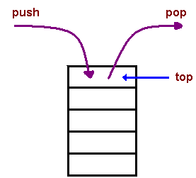

# Pilas y Colas

## Introducción

### ¿Qué es un arreglo?  

- Una estructura de datos de acceso aleatorio.  
- Se puede acceder a cualquier elemento en **tiempo constante**.  
- Un ejemplo típico de acceso aleatorio es un **libro**.  
- El acceso aleatorio es fundamental en varios algoritmos, como la **búsqueda binaria**.  

### ¿Qué es una lista enlazada?  

- Una estructura de datos de **acceso secuencial**.  
- Solo se puede acceder a un elemento en un orden específico.  
- Un ejemplo típico de acceso secuencial es un **rollo de papel** o una **cinta magnética**.  

### ¿Existen otros tipos de estructuras de datos?  

- Existen subcasos de las estructuras de datos secuenciales.  
- Algunas son **estructuras de acceso limitado**.  

**Ejemplos de estructuras de acceso limitado:**  

- **Pilas**  
- **Colas**  

## Pilas

### ¿Qué es una pila?  

- Es un **contenedor de objetos** donde se pueden insertar y extraer elementos según el **principio LIFO** (*Last In, First Out*).  
- Tiene dos operaciones básicas:  
	  - **Push**: Inserta un elemento.  
	  - **Pop**: Extrae un elemento.  
- Se considera una **estructura de acceso limitado**, ya que solo se puede insertar y extraer desde la **parte superior**.  
- Es una **estructura recursiva**.  

### Representación visual de una pila  

  

### ¿Cuál sería una definición estructural de una pila?  

- Una pila puede estar **vacía**.  
- O puede estar compuesta por dos partes:  
	  - **La cima de la pila** (un valor).  
	  - **El resto** (otra pila).  

### ¿Qué nos dice esta definición?  

- Que sigue el **patrón normal de una definición recursiva**.  

#### Casos:  

- **Caso base:** Un conjunto vacío es un valor válido para la pila.  
- **Caso recursivo:** Una cima y otra pila también son valores válidos para una pila.  

### Otra representación visual  

  

### Ejemplo  

Sea $S = (7,(29,(11,\emptyset)))$, ¿es $S$ una pila válida?  

# Definición del TAD Pila (Abstract Data Type)  

### Nombre  

**TAD Pila**  

### Objeto abstracto  

$Stack = \langle \langle e_1,e_2,e_3,...,e_n \rangle, top \rangle$  

### Invariante  

$0 \leq n \, \wedge \, Size(Stack) = n \, \wedge \, top = e_n$  

### Operaciones del Constructor  

- **Stack** $- \longrightarrow Stack$  
	  - Construye una pila vacía.  
	  - **Precondiciones:** Ninguna.  
	  - **Postcondiciones:** La pila es $s = \emptyset$.  
  

### Modificadores

####  *push*

$Stack \times Element \longrightarrow Stack$  
- Agrega el nuevo elemento $e$ a la pila $s$.  
- **Precondiciones:**  
  - Pila $s =  \langle e_1,e_2,e_3,...,e_n \rangle$ y elemento $e$  
  - o $s = \emptyset$ y elemento $e$  
- **Postcondiciones:**  
  - Pila $s =  \langle e_1,e_2,e_3,...,e_n, e \rangle$  
  - o $s = \langle e \rangle$  

#### *pop*

$Stack \longrightarrow Stack$  
- Extrae de la pila $s$ el elemento insertado más recientemente.  
- **Precondiciones:**  
  - Pila $s \neq \emptyset$, es decir, $s =  \langle e_1,e_2,e_3,...,e_n \rangle$  
- **Postcondiciones:**  
  - Pila $s =  \langle e_1,e_2,e_3,...,e_{n-1} \rangle$  

#### *top*

$Stack \longrightarrow Element$  
- Recupera el valor del elemento en la cima de la pila.  
- **Precondiciones:**  
  - Pila $s \neq \emptyset$, es decir, $s =  \langle e_1,e_2,e_3,...,e_n \rangle$  
- **Postcondiciones:**  
  - Elemento $e_n$  

#### *isEmpty*
$Stack \longrightarrow boolean$  
- Determina si la pila $s$ está vacía o no.  
- **Precondiciones:**  
  - Pila $s$  
- **Postcondiciones:**  
  - `True` si $s = \emptyset$  
  - `False` si $s \neq \emptyset$  

### Destructores  

#### *~Stack*
$Stack \longrightarrow -$  
- Destruye la pila $s$ liberando memoria.  
- **Precondiciones:**  
  - Pila $s$  
- **Postcondiciones:**  
  - Ninguna.  

## Ejemplo de impresión de una pila  

```java
printStack(Stack s) {
  while (!s.isEmpty()) { 
    elem = s.top();
    s.pop();
    print elem;
  }
}
```

### Axiomas que deben cumplir las operaciones de acceso en un TAD Pila

Sea $s$ una pila y $e$ un elemento.

* $(s.Stack()).isEmpty() = true$
* $(s.push(e)).isEmpty() = false$
* $(s.Stack( )).top() = error$
* $(s.push(e)).top() = e$
* $(s.Stack()).pop() = error$
* $(s.push(e)).pop() = e$

### Similitudes entre una pila y una lista

* top() es equivalente a obtener el primer elemento de una lista.
* pop() es equivalente a eliminar el primer elemento de la lista.
* push(e) es equivalente a agregar un elemento al inicio de la lista.

### Principales operaciones en la clase Stack de Java

* boolean empty() → (isEmpty())
* E peek() → (top())
* E pop() → (pop())
* E push(E item) → (push(E item))

### Implementación del TAD de una Pila

**interfaz?**


### ¿Una implementación basada en arreglos?

**Representación gráfica:**


### Implementación dinámica

**Representación gráfica:**


### ¿Una implementación basada en arreglos?

**Representación gráfica:**


